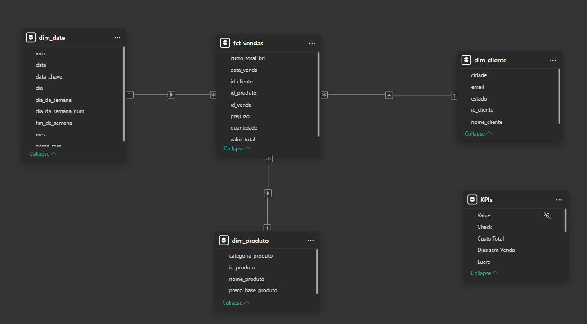
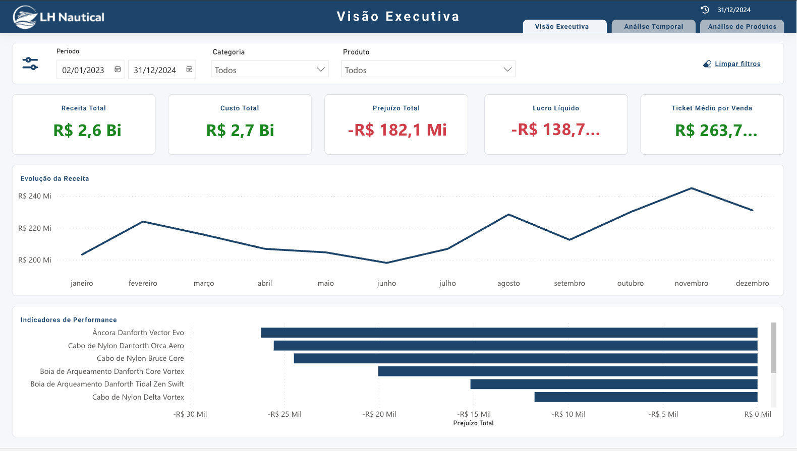

#  LH Nautical — Desafio Lighthouse Dados e IA


##  Contexto do Problema

A LH Nautical enfrenta um cenário de:

- Dados desorganizados
- Sistemas desconectados
- Decisões baseadas em intuição

O objetivo foi transformar esses dados em **informação estruturada e insights acionáveis**.

O projeto inclui um dashboard desenvolvido em Power BI com: 
[Acessar Dashboard no Power BI](https://app.powerbi.com/view?r=eyJrIjoiZDNlMWFhMWEtMjgzMC00NGE1LWI2YWYtZTIyN2FjYjdkZWU0IiwidCI6IjcyOWI2MzAwLTQzMmMtNDUxZS1hMDRhLTQxZjBmNWY2NzY5NCJ9)

---

##  Notebooks do Projeto

As respostas de todas as questões estão implementadas e detalhadas nos notebooks abaixo, incluindo explicações, etapas de raciocínio e validações.

---

###  Análise Exploratória e Limpeza

- [EDA e Limpeza - Vendas](notebooks/eda_and_cleaning_vendas_2023_2024.ipynb)
- [EDA e Limpeza - Produtos](notebooks/eda_and_cleaning_produtos_raw.ipynb)
- [EDA e Limpeza - Custos de Importação](notebooks/eda_and_cleaning_custos_importacao.ipynb)
- [EDA e Limpeza - Clientes](notebooks/eda_and_cleaning_clientes_crm.ipynb)

---

###  Resolução das Questões

- [Questão 1 — EDA](notebooks/01_questao_1.ipynb)
- [Questão 2 — Produtos](notebooks/02_questao_2.ipynb)
- [Questão 3 — Custos de Importação](notebooks/03_questao_3.ipynb)
- [Questão 4 — Dados Públicos](notebooks/04_questao_4.ipynb)
- [Questão 5 — Análise de Clientes](notebooks/05_questao_5.ipynb)
- [Questão 6 — Dimensão de Calendário](notebooks/06_questao_6.ipynb)
- [Questão 7 — Previsão de Demanda](notebooks/07_questao_7.ipynb)
- [Questão 8 — Sistema de Recomendação](notebooks/08_questao_8.ipynb)

---

###  Modelagem de Dados

- [Modelo Star Schema](notebooks/09_modeling_star_schema.ipynb)
- [Dimensão de Datas](notebooks/marts_dimensao_date.ipynb)



##  Etapas do Projeto

###  1. EDA (Análise Exploratória)
- Avaliação da qualidade dos dados
- Identificação de outliers
- Análise de distribuição

---

###  2. Tratamento de Dados
- Padronização de categorias
- Conversão de tipos
- Remoção de duplicidades
- Estruturação de JSON em formato tabular

---

###  3. Análise de Vendas
- Cálculo de receita e prejuízo
- Conversão USD → BRL com câmbio diário
- Identificação de produtos com prejuízo

---

###  4. Análise de Clientes
- Ticket médio
- Frequência de compras
- Diversidade de categorias
- Identificação dos clientes "elite"

---

###  5. Análise Temporal
- Construção de dimensão de calendário
- Inclusão de dias sem vendas
- Cálculo correto de médias por dia da semana

---

###  6. Previsão de Demanda
- Modelo baseline: média móvel de 7 dias
- Previsão diária para janeiro de 2024
- Avaliação com MAE

---

### 7. Sistema de Recomendação
- Matriz cliente × produto
- Similaridade de cosseno
- Ranking de produtos similares

---

##  Dashboard

O projeto inclui um dashboard desenvolvido em Power BI com: 
[Acessar Dashboard no Power BI](https://app.powerbi.com/view?r=eyJrIjoiZDNlMWFhMWEtMjgzMC00NGE1LWI2YWYtZTIyN2FjYjdkZWU0IiwidCI6IjcyOWI2MzAwLTQzMmMtNDUxZS1hMDRhLTQxZjBmNWY2NzY5NCJ9)

- KPIs principais
- Receita e prejuízo
- Análise por produto
- Análise temporal
- Insights de negócio




---

## Tecnologias Utilizadas

- Python (Pandas, NumPy)
- SQL
- Power BI
- Jupyter Notebook

---

## Principais Insights

- Identificação de produtos vendidos com prejuízo   
- Impacto de dias sem vendas na média semanal  
- Limitações do modelo baseline de previsão  
- Recomendações baseadas em comportamento de compra  

---

## Limitações

- Modelo preditivo simples (baseline)  
- Sistema de recomendação sem features adicionais  
- Dados simulados (cenário fictício)  

---

## Próximos Passos

- Implementar modelos de Machine Learning mais robustos  
- Criar pipeline automatizado (ELT) com dbt e Databricks
- Deploy do dashboard  


##  Como Executar o Projeto

1. Clone o repositório:

```bash
git clone https://github.com/RichardGomesData/lh-nautical-data-project
cd lh-nautical-data-project


python -m venv venv
source venv/bin/activate  # Mac/Linux
venv\Scripts\activate     # Windows

pip install -r requirements.txt